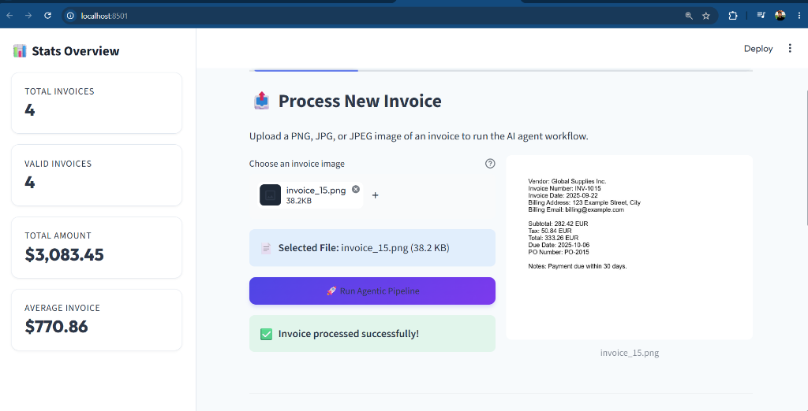
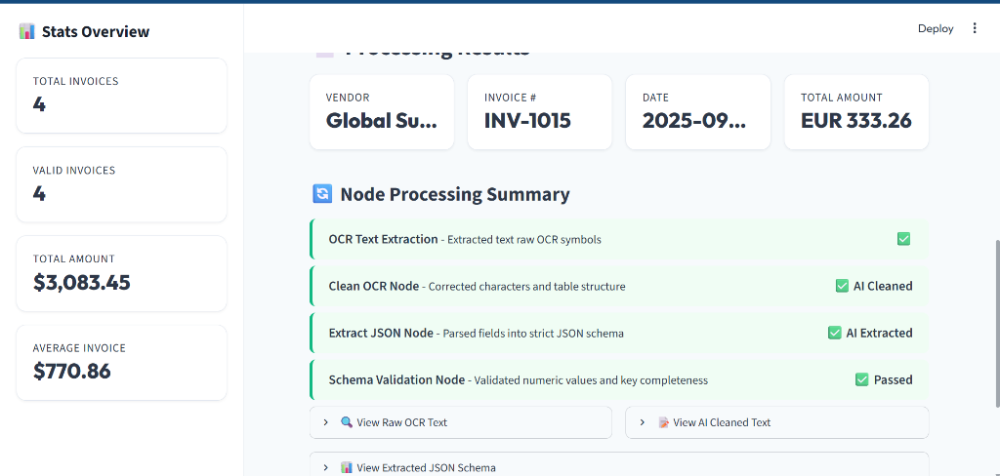
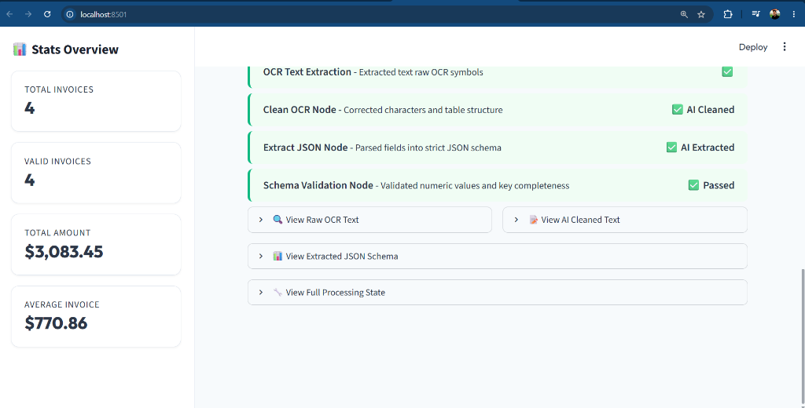
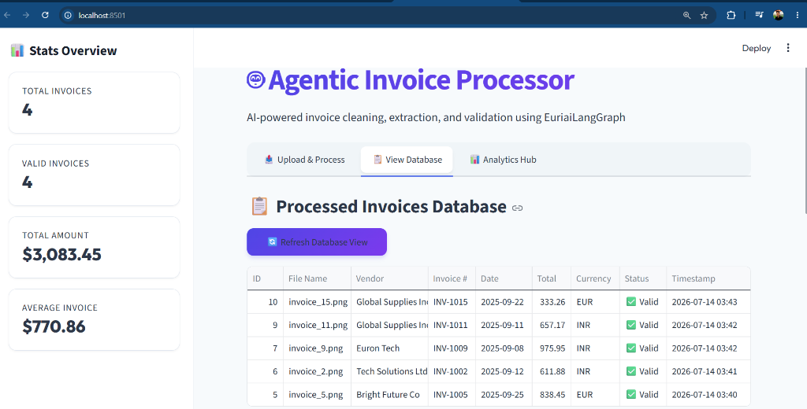
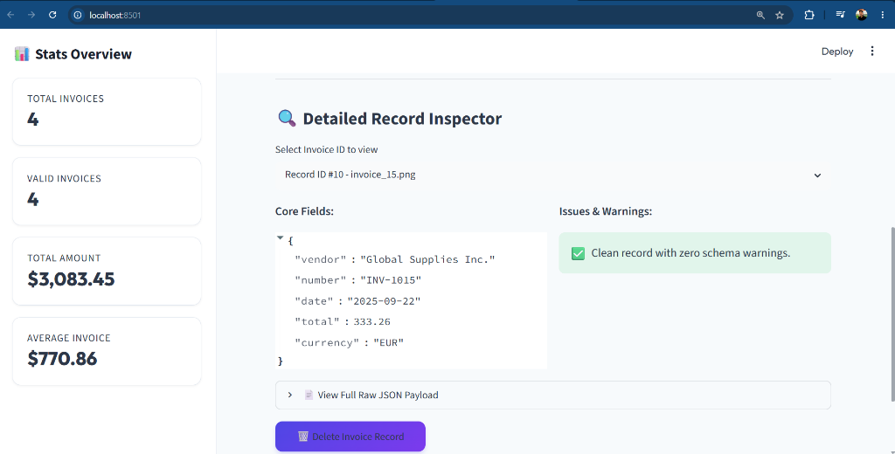

# 🤖 Agentic Invoice Processor

A beautiful, demo-ready invoice processing system built with **Streamlit** and **LangGraph** (powered by the **Euri AI SDK**) that uses AI agents to extract structured data from invoice images.

## ✨ Features

- **🤖 Pure Agentic Architecture**: Built with LangGraph for intelligent, multi-step invoice cleaning and extraction
- **🔍 OCR Integration**: Uses EasyOCR for text extraction from invoice images
- **🧠 AI-Powered Cleaning**: Euri AI models correct OCR character errors and restore readable structures
- **🧩 AI-Powered JSON Extraction**: Automatically parses unstructured cleaned text into a strict JSON schema
- **✅ Validation**: Verification of critical fields (vendor, date, total, currency format)
- **💾 SQLite Database**: Persistent storage and querying of processed records
- **🔐 Secure Access**: Optional password protection to prevent unauthorized API key usage
- **📊 Analytics Dashboard**: Visual graphs and statistics of all processed invoices
- **🎨 Premium Light UI**: Styled with Outfit typography, custom headers, and glassmorphism cards

---

## 🖼️ Application Screenshots

### 1. Upload & Process Invoice
Upload any PNG, JPG, or JPEG image of an invoice and execute the agentic workflow with real-time progress indicators.


### 2. Node Processing Summary & Metrics
View the status of each LangGraph pipeline step (OCR, CLEAN, EXTRACT, VALIDATION) and immediately see extracted metadata cards.


### 3. Detailed Results & Expanders
Drill down into the raw OCR text, AI-cleaned text, formatted JSON output, and the complete LangGraph state payload.


### 4. Processed Invoices Database
Browse all historical records in a table including status indicators, timestamps, totals, and currency codes.


### 5. Detailed Record Inspector
Inspect any row from the database in detail, showing structured JSON values, specific validation warnings, and delete options.


---

## 🚀 Quick Start

### Prerequisites

- Python 3.8+
- Euri AI API key (`EURI_API_KEY`)

### Installation

1. **Clone or navigate to the project directory:**
   ```bash
   cd Invoice_Agentic_Processor
   ```

2. **Create a virtual environment (recommended):**
   ```bash
   python -m venv invoice-env
   source invoice-env/bin/activate  # On Windows: invoice-env\Scripts\activate
   ```

3. **Install dependencies:**
   ```bash
   pip install -r requirements.txt
   ```

4. **Set up environment variables:**
   Create a `.env` file in the project root:
   ```bash
   EURI_API_KEY=your_euri_api_key_here
   APP_PASSWORD=optional_access_password
   ```

5. **Run the Streamlit app:**
   ```bash
   python run.py
   ```
   The app will open in your browser at `http://localhost:8501`

---

## 📖 Usage

### Processing Invoices
1. **Upload an Invoice**: In the "Upload & Process" tab, select an invoice image and click **🚀 Run Agentic Pipeline**.
2. **View Results**: Inspect extracted metrics (Vendor, Invoice #, Date, Total) and verify processing statuses.
3. **Browse Invoices**: Browse the "View Database" tab to search, inspect raw JSON data, and delete records.
4. **Analytics**: Go to "Analytics Hub" to view charts displaying invoice volume, total amount, and top vendors.

---

## 🏗️ Architecture

### Agentic Workflow
The system uses LangGraph and the Euri AI SDK to build two specialized node chains:
```
OCR Text -> CLEAN AI Node -> EXTRACT AI Node -> SCHEMA VALIDATE -> DATABASE PERSIST -> CONSOLE NOTIFY
```
1. **CLEAN Node**: Corrects noise, character identification mistakes, and preserves details.
2. **EXTRACT Node**: Translates clean unstructured text into a strict JSON payload.
3. **VALIDATE Node**: Evaluates totals, currencies, and required field completeness.

### Project Structure
```
Invoice_Agentic_Processor/
├── main.py                # Streamlit UI dashboard entrypoint
├── run.py                 # Startup script with env variable verification
├── screenshots/           # Screenshot images for documentation
├── agents/
│   └── invoice_agent.py   # EuriaiLangGraph agent configuration
├── utils/
│   ├── ocr.py             # EasyOCR text reader
│   └── database.py        # SQLite invoice DB driver
├── requirements.txt       # Python dependencies
└── invoice.db             # Local SQLite database
```

---

## 🔧 Configuration

### Model Selection
You can toggle Euri's models in the sidebar:
- `gpt-4.1-nano` (default, lightweight and optimized for extraction tasks)
- `gpt-4o` (highly accurate)
- `gpt-4o-mini` (cost-effective)
- `gpt-3.5-turbo` (fastest)

### Secrets (Streamlit Cloud Deploy)
Configure your variables in share.streamlit.io Advanced Settings:
```toml
EURI_API_KEY = "your-api-key"
APP_PASSWORD = "optional-password"
```

---

## 📝 License
This project is open-source and intended for demonstration purposes. Built using **Streamlit, LangGraph, and the Euri AI SDK**.
